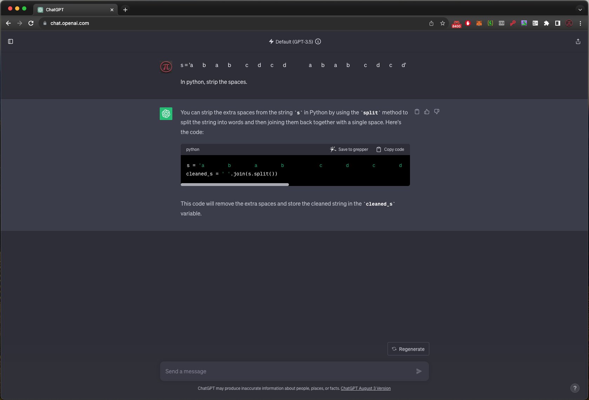
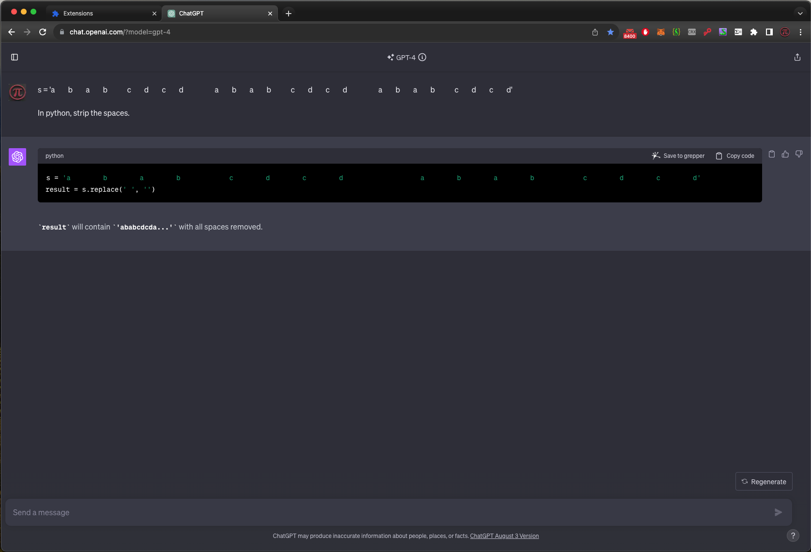

# ChatGPT-fixMargins Chrome Extension

## Overview

This Chrome extension aims to address the issue of excessive, space-wasting margins in ChatGPT's WebUI (chat.openai.com). When working with code outputs or lengthy responses, the default margins can make it difficult to see the full content. This extension modifies the CSS to offer a more streamlined and efficient use of screen real estate.

Normal ChatGPT:

Margins fixed:

## Installation

1. **Download or Clone the Repo**: Download this repository to your local machine.
   
2. **Open Chrome Extensions**: Open Chrome and navigate to `chrome://extensions/`.

3. **Enable Developer Mode**: Turn on `Developer mode` at the top-right corner of the Extensions page.

4. **Load Unpacked Extension**: 
    - Click `Load unpacked`.
    - Navigate to the directory where you downloaded or cloned this repository.
    - Select the `extension` folder.
    - Click `Open`.

Your extension should now be installed and will remain active (across Chrome restarts) as long as Developer Mode is enabled.
